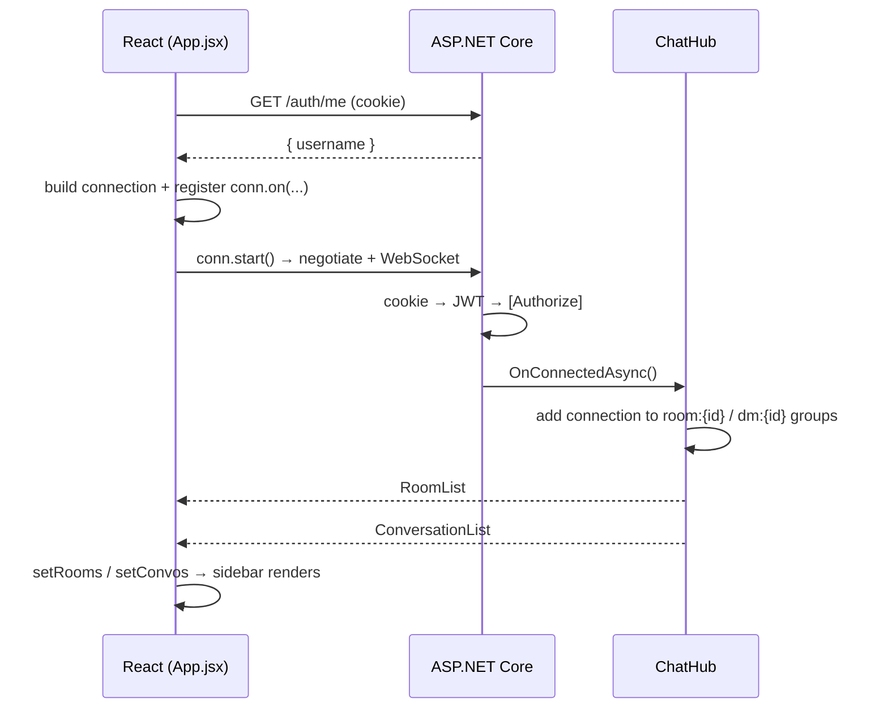

# SignalR Guide

How SignalR is wired up in ChatApp, and what happens at runtime.

- **Backend:** ASP.NET Core ([Program.cs](chat-backend/Program.cs), [ChatHub.cs](chat-backend/Hubs/ChatHub.cs))
- **Frontend:** React + `@microsoft/signalr` ([App.jsx](chat-frontend/src/App.jsx))

---

## Part 1 — Configuration

### Step 1. Register SignalR (backend)

SignalR ships with ASP.NET Core, so there's no NuGet package to install.

```csharp
// Program.cs
builder.Services.AddSignalR();
```

### Step 2. Put the user ID in the JWT (backend)

`Clients.User(id)` finds a user's connections through the `NameIdentifier` claim.

```csharp
// Services/AuthService.cs
claims:
[
    new Claim(ClaimTypes.NameIdentifier, user.Id.ToString()),  // used by Clients.User(...)
    new Claim(ClaimTypes.Name, user.Username),
],
```

### Step 3. Read the JWT from the cookie (backend)

Browsers can't set an `Authorization` header on a WebSocket, so the token travels in the `auth_token` cookie instead.

```csharp
// Program.cs
.AddJwtBearer(options =>
{
    options.TokenValidationParameters = new TokenValidationParameters { /* issuer, audience, key */ };

    options.Events = new JwtBearerEvents
    {
        OnMessageReceived = ctx =>
        {
            if (ctx.Request.Cookies.TryGetValue("auth_token", out var token))
                ctx.Token = token;
            return Task.CompletedTask;
        }
    };
});
```

### Step 4. Allow credentials in CORS (backend)

This is needed whenever the frontend calls the backend from a different origin. A request that carries cookies needs `AllowCredentials()`.

```csharp
// Program.cs
builder.Services.AddCors(options =>
    options.AddDefaultPolicy(policy =>
        policy.WithOrigins("http://localhost:5173")
              .AllowAnyHeader()
              .AllowAnyMethod()
              .AllowCredentials()));
```

### Step 5. Add middleware and map the hub (backend)

Order matters: CORS, then authentication, then authorization, then the endpoints.

```csharp
// Program.cs
app.UseCors();
app.UseAuthentication();
app.UseAuthorization();

app.MapHub<ChatHub>("/chatHub");
```

### Step 6. Create the hub (backend)

```csharp
// Hubs/ChatHub.cs
[Authorize]                                   // reject connections without a valid token
public class ChatHub(
    IRoomRepository rooms,
    IConversationRepository conversations,
    IRoomMessageRepository roomMessages,
    IDirectMessageRepository directMessages) : Hub
{
    private int UserId => int.Parse(Context.User!.FindFirstValue(ClaimTypes.NameIdentifier)!);
    private string Username => Context.User!.FindFirstValue(ClaimTypes.Name)!;

    public async Task SendMessage(int targetId, string targetType, string message) { /* ... */ }
    public async Task GetHistory(int targetId, string targetType) { /* ... */ }
    public async Task JoinRoom(int roomId) { /* ... */ }
    public async Task JoinConversation(int conversationId) { /* ... */ }
    public async Task LeaveRoom(int roomId) { /* ... */ }
    public override async Task OnConnectedAsync() { /* ... */ }
}
```

### Step 7. Install the client and proxy WebSockets (frontend)

```bash
npm install @microsoft/signalr
```

```js
// vite.config.js
proxy: {
  '/chatHub': {
    target: 'http://localhost:5065',
    ws: true,            // forward the WebSocket upgrade
    changeOrigin: true,
  },
  // '/auth', '/rooms', '/conversations', '/users' → same target
}
```

### Step 8. Build the connection (frontend)

```js
// App.jsx
import * as signalR from '@microsoft/signalr'

const connectionRef = useRef(null)   // keeps the connection across renders
const activeRef = useRef(null)       // current chat, readable inside handlers

const conn = new signalR.HubConnectionBuilder()
  .withUrl('/chatHub')               // the cookie is sent automatically
  .withAutomaticReconnect()          // retries after 0s, 2s, 10s, 30s
  .build()
```

---

## Part 2 — Runtime Flow

### A. Initialization



**1. On page load, check whether the user is logged in**

```js
// App.jsx
useEffect(() => {
  fetch('/auth/me', { credentials: 'include' })
    .then(res => res.ok ? res.json() : null)
    .then(async data => {
      if (data?.username) {
        setUsername(data.username)
        await startConnection()
      }
    })
}, [startConnection])
```

After login or register, `handleAuth` calls `startConnection()` in the same way.

**2. Register handlers, then start the connection**

Handlers go in before `start()` so no early events are missed.

```js
// App.jsx — inside startConnection()
conn.on('RoomList', roomList => setRooms(roomList))
conn.on('ConversationList', convoList => setConvos(convoList))
// ...RoomAdded, RoomRemoved, ConversationStarted, MessageHistory, ReceiveMessage

conn.onreconnecting(() => setConnStatus('reconnecting'))
conn.onreconnected(() => setConnStatus('connected'))
conn.onclose(() => setConnStatus('disconnected'))

connectionRef.current = conn
setConnStatus('connecting')
await conn.start()
setConnStatus('connected')
```

**3. The server adds the connection to groups and sends the sidebar data**

```csharp
// ChatHub.cs
public override async Task OnConnectedAsync()
{
    var memberships = await rooms.GetMembershipsForUserAsync(UserId);
    foreach (var m in memberships)
        await Groups.AddToGroupAsync(Context.ConnectionId, $"room:{m.RoomId}");

    var userConversations = await conversations.GetConversationsForUserAsync(UserId);
    foreach (var c in userConversations)
        await Groups.AddToGroupAsync(Context.ConnectionId, $"dm:{c.Id}");

    await Clients.Caller.SendAsync("RoomList", memberships.Select(m => new { id = m.RoomId, name = m.Room.Name, isAdmin = ... }));
    await Clients.Caller.SendAsync("ConversationList", userConversations.Select(c => new { id = c.Id, otherUsername = ... }));

    await base.OnConnectedAsync();
}
```

> **Groups** are the routing mechanism. Everyone in `room:5` receives messages sent to that group.

---

### B. Triggers

#### 1. Opening a chat → load history

```js
// App.jsx — handleSelectChat
activeRef.current = item
setMessages([])
await connectionRef.current.invoke('GetHistory', item.id, item.type)
```

```csharp
// ChatHub.cs
if (!await rooms.IsMemberAsync(targetId, userId)) return;
var history = await roomMessages.GetRecentAsync(targetId);
await Clients.Caller.SendAsync("MessageHistory", new { targetId, targetType = "room", messages = ... });
```

```js
// App.jsx — ignore the response if the user has already switched chats
conn.on('MessageHistory', data => {
  const cur = activeRef.current
  if (cur?.id === data.targetId && cur?.type === data.targetType) setMessages(...)
})
```

#### 2. Sending a message → broadcast to the group

```js
// App.jsx — sendMessage
await connectionRef.current.invoke('SendMessage', active.id, active.type, text)
```

```csharp
// ChatHub.cs
if (!await rooms.IsMemberAsync(targetId, userId)) return;
await roomMessages.SaveAsync(targetId, userId, message);
await Clients.Group($"room:{targetId}").SendAsync("ReceiveMessage", new
{
    targetId, targetType = "room", user = username, text = message, sentAt,
});
```

```js
// App.jsx — the sender receives its own message back this way too
conn.on('ReceiveMessage', msg => {
  const cur = activeRef.current
  if (cur?.id === msg.targetId && cur?.type === msg.targetType) {
    setMessages(prev => [...prev, { user: msg.user, text: msg.text, time: new Date(msg.sentAt) }])
  } else {
    setUnread(prev => new Set([...prev, `${msg.targetType === 'room' ? 'room' : 'dm'}:${msg.targetId}`]))
  }
})
```

#### 3. Creating a room → the creator joins the group

`POST /rooms` is plain REST, so the client joins the SignalR group itself.

```js
// App.jsx — handleRoomCreated
setRooms(prev => [...prev, room])
connectionRef.current?.invoke('JoinRoom', room.id)
```

```csharp
// ChatHub.cs
public async Task JoinRoom(int roomId)
{
    if (!await rooms.IsMemberAsync(roomId, UserId)) return;
    await Groups.AddToGroupAsync(Context.ConnectionId, $"room:{roomId}");
}
```

#### 4. An admin adds a member → notify that user

REST endpoints push events through `IHubContext<ChatHub>`.

```js
// App.jsx — AddMember modal (admin's browser)
await fetch(`/rooms/${roomId}/members`, { method: 'POST', credentials: 'include', body: JSON.stringify({ username }) })
```

```csharp
// Program.cs — POST /rooms/{id}/members
await rooms.AddMemberAsync(id, targetUser.Id);
await hub.Clients.User(targetUser.Id.ToString())            // all of that user's tabs
    .SendAsync("RoomAdded", new { id, name = room!.Name, isAdmin = false });
```

```js
// App.jsx — added user's browser
conn.on('RoomAdded', room => {
  setRooms(prev => [...prev, room])
  conn.invoke('JoinRoom', room.id)     // the DB already says member, so the check passes
})
```

#### 5. An admin removes a member → notify that user

```csharp
// Program.cs — DELETE /rooms/{id}/members/{userId}
await rooms.RemoveMemberAsync(id, userId);
await hub.Clients.User(userId.ToString()).SendAsync("RoomRemoved", new { id });
```

```js
// App.jsx
conn.on('RoomRemoved', ({ id }) => {
  setRooms(prev => prev.filter(r => r.id !== id))
  if (activeRef.current?.type === 'room' && activeRef.current?.id === id) { setActive(null); setMessages([]) }
  conn.invoke('LeaveRoom', id)
})
```

#### 6. Starting a DM → both users join `dm:{id}`

```js
// App.jsx — starter's browser
const res = await fetch('/conversations', { method: 'POST', credentials: 'include', body: JSON.stringify({ username }) })
// then handleDmStarted → invoke('JoinConversation', convo.id)
```

```csharp
// Program.cs — POST /conversations
var conversation = await conversations.GetOrCreateAsync(currentUserId, targetUser.Id);
await hub.Clients.User(targetUser.Id.ToString())
    .SendAsync("ConversationStarted", new { id = conversation.Id, fromUsername = currentUsername });
```

```js
// App.jsx — other user's browser
conn.on('ConversationStarted', data => {
  setConvos(prev => prev.some(c => c.id === data.id) ? prev : [...prev, { id: data.id, otherUsername: data.fromUsername }])
  conn.invoke('JoinConversation', data.id)
})
```

#### 7. Reconnect and logout

- **Reconnect:** `withAutomaticReconnect` opens a new connection, so `OnConnectedAsync` runs again. Groups are restored and `RoomList` and `ConversationList` are sent again.
- **Logout:** the client calls the endpoint, then stops the connection. SignalR removes the connection from all groups automatically.

```js
// App.jsx — handleLogout
await fetch('/auth/logout', { method: 'POST', credentials: 'include' })
await connectionRef.current?.stop()
```

---

## Quick Reference

| Client → Server (`invoke`) | Server → Client (`on`) |
|---|---|
| `SendMessage(targetId, targetType, text)` | `ReceiveMessage` → group |
| `GetHistory(targetId, targetType)` | `MessageHistory` → caller |
| `JoinRoom(roomId)` / `LeaveRoom(roomId)` | `RoomList`, `ConversationList` → caller, on connect |
| `JoinConversation(conversationId)` | `RoomAdded`, `RoomRemoved`, `ConversationStarted` → one user, from REST |

| Send target | Used for |
|---|---|
| `Clients.Caller` | Replies to the calling connection only (history, initial lists) |
| `Clients.Group("room:5")` | Chat messages |
| `Clients.User("42")` | Notifications from REST endpoints, sent to every connection of that user |
